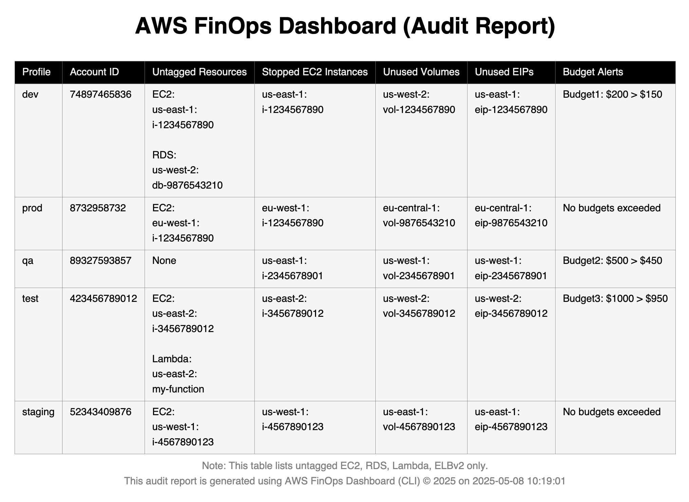
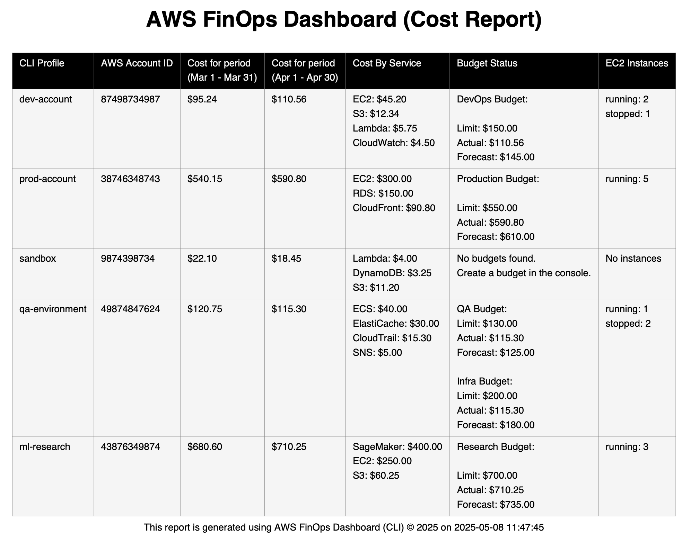

# AWS FinOps Dashboard (CLI) v2.2.7

[](https://pypi.org/project/aws-finops-dashboard/)
[](https://opensource.org/licenses/MIT)
[](https://github.com/ravikiranvm/aws-finops-dashboard/stargazers)
[](https://pepy.tech/project/aws-finops-dashboard)

The AWS FinOps Dashboard is an open-source, Python-based command-line tool (built with the Rich library) for AWS cost monitoring. It provides multi-account cost summaries by time period, service, and cost allocation tags; budget limits vs. actuals; EC2 instance status; six‑month cost trend charts; and "FinOps audit" reports (e.g. untagged or idle resources). It can export data to CSV/JSON/PDF.

## Why AWS FinOps Dashboard?

Managing and understanding your AWS expenditure, especially across multiple accounts and services, can be complex. The AWS FinOps Dashboard CLI aims to simplify this by providing a clear, concise, and actionable view of your AWS costs and operational hygiene directly in your terminal.

Key features include:
*   **Unified View:** Consolidate cost and resource data from multiple AWS accounts.

* **Cost Trend Analysis:** View how your AWS costs have been for the past six months.

*   **Audit Your AWS Accounts:** Quickly identify spending patterns, untagged resources, underutilised resources and potential savings.

*   **Generate Cost & Audit Reports:** You can generate Cost, Trend and Audit Reports in PDF, CSV & JSON formats for further analysis and reporting purposes.



## Table of Contents

- [Features](#features)
- [Prerequisites](#prerequisites)
- [Installation](#installation)
- [AWS CLI Profile Setup](#aws-cli-profile-setup)
- [Command Line Usage](#command-line-usage)
  - [Options](#command-line-options)
  - [Examples](#examples)
- [Using a Configuration File](#using-a-configuration-file)
  - [TOML Configuration Example (`config.toml`)](#toml-configuration-example-configtoml)
  - [YAML Configuration Example (`config.yaml` or `config.yml`)](#yaml-configuration-example-configyaml-or-configyml)
  - [JSON Configuration Example (`config.json`)](#json-configuration-example-configjson)
- [Export Formats](#export-formats)
- [Cost For Every Run](#cost-for-every-run)
- [Contributing](#contributing)
- [License](#license)

---

## Features

- **Cost Analysis by Time Period**: 
  - View current & previous month's spend by default
  - Set custom time ranges (e.g., 7, 30, 90 days) with `--time-range` option
- **Cost by AWS Service**: Sorted by highest cost for better insights
- **Cost by Tag**: Get the cost data by one or more tags with `--tag`(cost allocation tags must be enabled)
- **AWS Budgets Information**: Displays budget limits and actual spend
- **EC2 Instance Status**: Detailed state information across specified/accessible regions
- **Cost Trend Analysis**: View detailed cost trends in bar charts for the last 6 months across AWS profiles
- **FinOps Audit**: View untagged resources, unused or stopped resources, and Budget breaches across AWS profiles. 
- **Reserved Instance & Savings Plan Optimization**: Get data-driven recommendations for Reserved Instance purchases and Savings Plan commitments based on usage patterns, with estimated savings potential.
- **Profile Management**:
  - Automatic profile detection
  - Specific profile selection with `--profiles`
  - Use all available profiles with `--all`
  - Combine profiles from the same AWS account with `--combine`
- **Region Control**: Specify regions for EC2 discovery using `--regions`
- **Export Options**:
  - CSV export with `--report-name` and `--report-type csv`
  - JSON export with `--report-name` and `--report-type json`
  - PDF export with `--report-name` and `--report-type pdf`
  - Export to both CSV and JSON formats with `--report-name` and `--report-type csv json`
  - Specify output directory using `--dir`
  - **Note**: Trend reports (generated via `--trend`) currently only support JSON export. Other formats specified in `--report-type` will be ignored for these reports.
- **Improved Error Handling**: Resilient and user-friendly error messages
- **Beautiful Terminal UI**: Styled with the Rich library for a visually appealing experience
- **ML-Based Anomaly Detection**: Automatically identify unusual spending patterns
- **AI-Powered Cost Optimization**: Get smart recommendations for cost savings based on usage patterns

---

## Prerequisites

- **Python 3.8 or later**: Ensure you have the required Python version installed
- **AWS CLI configured with named profiles**: Set up your AWS CLI profiles for seamless integration
- **AWS credentials with permissions**:
  - `ce:GetCostAndUsage`
  - `budgets:ViewBudget`
  - `ec2:DescribeInstances`
  - `ec2:DescribeRegions`
  - `sts:GetCallerIdentity`
  - `ec2:DescribeInstances`
  - `ec2:DescribeVolumes`
  - `ec2:DescribeAddresses`
  - `rds:DescribeDBInstances`
  - `rds:ListTagsForResource`
  - `lambda:ListFunctions`
  - `lambda:ListTags`
  - `elbv2:DescribeLoadBalancers`
  - `elbv2:DescribeTags`
  
---

## Installation

There are several ways to install the AWS FinOps Dashboard:

### Option 1: Using pipx (Recommended)
```bash
pipx install aws-finops-dashboard
```

If you don't have `pipx`, install it with:

```bash
python -m pip install --user pipx
python -m pipx ensurepath
```

### Option 2: Using pip
```bash
pip install aws-finops-dashboard
```

### Option 3: Using uv (Fast Python Package Installer)
[uv](https://github.com/astral-sh/uv) is a modern Python package installer and resolver that's extremely fast.

```bash
# Install uv if you don't have it yet
curl -LsSf https://astral.sh/uv/install.sh | sh

# Install aws-finops-dashboard
uv pip install aws-finops-dashboard
```

### Option 4: From Source
```bash
# Clone the repository
git clone https://github.com/ravikiranvm/aws-finops-dashboard.git
cd aws-finops-dashboard

# Install using pip
pip install -e .
```

---

## AWS CLI Profile Setup

If you haven't already, configure your named profiles using the AWS CLI:

```bash
aws configure --profile profile1-name
aws configure --profile profile2-name
# ... etc ...
```

Repeat this for all the profiles you want the dashboard to potentially access.

---

## Command Line Usage

Run the script using `aws-finops` followed by options:

```bash
aws-finops [options]
```

### Command Line Options

| Flag | Description |
|---|---|
| `--config-file`, `-C` | Path to a TOML, YAML, or JSON configuration file. Command-line arguments will override settings from the config file. |
| `--profiles`, `-p` | Specific AWS profiles to use (space-separated). If omitted, uses 'default' profile if available, otherwise all profiles. |
| `--regions`, `-r` | Specific AWS regions to check for EC2 instances (space-separated). If omitted, attempts to check all accessible regions. |
| `--all`, `-a` | Use all available AWS profiles found in your config. |
| `--combine`, `-c` | Combine profiles from the same AWS account into single rows. |
| `--tag`, `-g` | Filter cost data by one or more cost allocation tags in `Key=Value` format. Example: `--tag Team=DevOps Env=Prod` |
| `--report-name`, `-n` | Specify the base name for the report file (without extension). |
| `--report-type`, `-y` | Specify report types (space-separated): 'csv', 'json', 'pdf'. For reports generated with `--audit`, only 'pdf' is applicable and other types will be ignored. |
| `--dir`, `-d` | Directory to save the report file(s) (default: current directory). |
| `--time-range`, `-t` | Time range for cost data in days (default: current month). Examples: 7, 30, 90. |
| `--trend` | View cost trend analysis for the last 6 months. |
| `--audit` | View list of untagged, unused resoruces and budget breaches. |
| `--detect-anomalies` | Run machine learning-based anomaly detection to identify unusual spending patterns. |
| `--anomaly-sensitivity` | Sensitivity for anomaly detection (0.01-0.1, lower values are more sensitive, default: 0.05). |
| `--optimize` | Generate AI-powered cost optimization recommendations. |
| `--cpu-threshold` | CPU utilization threshold for EC2 right-sizing recommendations (percent, default: 40.0). |
| `--skip-ri-analysis` | Skip Reserved Instance analysis when generating optimization recommendations. |
| `--skip-savings-plans` | Skip Savings Plans analysis when generating optimization recommendations. |
| `--currency`, `-u` | Currency to display costs in (choices: USD, INR, EUR, GBP, JPY, AUD, CAD, CNY, default: USD). |
| `--enhanced-pdf` | Generate enhanced PDF reports with visualizations and executive summary. |
| `--ri-optimizer` | Generate Reserved Instance and Savings Plan recommendations based on usage patterns. |
| `--lookback-days` | Number of days to analyze for RI and Savings Plan recommendations (default: 30). |

### Examples

```bash
# Use default profile, show output in terminal only
aws-finops

# Use specific profiles 'dev' and 'prod'
aws-finops --profiles dev prod

# Use all available profiles
aws-finops --all

# Combine profiles from the same AWS account
aws-finops --all --combine

# Specify custom regions to check for EC2 instances
aws-finops --regions us-east-1 eu-west-1 ap-southeast-2

# View cost data for the last 30 days instead of current month
aws-finops --time-range 30

# View cost data only for a specific tag (e.g., Team=DevOps)
aws-finops --tag Team=DevOps

# View cost data for multiple tags (e.g., Team=DevOps and Env=Prod)
aws-finops --tag Team=Devops Env=Prod

# Export data to CSV only
aws-finops --all --report-name aws_dashboard_data --report-type csv

# Export data to JSON only
aws-finops --all --report-name aws_dashboard_data --report-type json

# Export data to both CSV and JSON formats simultaneously
aws-finops --all --report-name aws_dashboard_data --report-type csv json

# Export combined data for 'dev' and 'prod' profiles to a specific directory
aws-finops --profiles dev prod --combine --report-name report --report-type csv --dir output_reports

# View cost trend analysis as bar charts for profile 'dev' and 'prod'
aws-finops --profiles dev prod -r us-east-1 --trend

# View cost trend analysis for all cli profiles for a specific cost tag 'Team=DevOps'
aws-finops --all --trend --tag Team=DevOps

# View audit report for profile 'dev' in region 'us-east-1'
aws-finops -p dev -r us-east-1 --audit

# View audit report for profile 'dev' in region 'us-east-1' and export it as a pdf file to current working dir with file name 'Dev_Audit_Report'
aws-finops -p dev -r us-east-1 --audit -n Dev_Audit_Report -y pdf

# Use a configuration file for settings
aws-finops --config-file path/to/your_config.toml
# or
aws-finops -C path/to/your_config.yaml

# View anomaly detection for all profiles
aws-finops --all --detect-anomalies

# View anomaly detection with custom sensitivity
aws-finops --profiles dev prod --detect-anomalies --anomaly-sensitivity 0.03

# Get cost optimization recommendations for all profiles
aws-finops --all --optimize

# Get cost optimization recommendations with custom CPU threshold
aws-finops --profiles dev prod --optimize --cpu-threshold 30.0

# Get cost optimization recommendations without Reserved Instance analysis
aws-finops --all --optimize --skip-ri-analysis

# Display costs in Indian Rupees (INR)
aws-finops --profiles dev prod -u INR

# Generate PDF report with costs in Euros
aws-finops --all --report-name aws_costs_eur --report-type pdf -u EUR

# Generate enhanced PDF report with visualizations and executive summary
aws-finops --all --report-name enhanced_report --report-type pdf --enhanced-pdf

# Generate RI and Savings Plan recommendations for all profiles
aws-finops --all --ri-optimizer

# Generate RI and Savings Plan recommendations with custom lookback period
aws-finops --profiles dev prod --ri-optimizer --lookback-days 60

# Generate RI and Savings Plan recommendations and export to PDF
aws-finops --all --ri-optimizer --report-name ri_recommendations --report-type pdf
```

You'll see a live-updating table of your AWS account cost and usage details in the terminal. If export options are specified, a report file will also be generated upon completion.

---

## Using a Configuration File

Instead of passing all options via the command line, you can use a configuration file in TOML, YAML, or JSON format. Use the `--config-file` or `-C` option to specify the path to your configuration file.

Command-line arguments will always take precedence over settings defined in the configuration file.

Below are examples of how to structure your configuration file.

### TOML Configuration Example (`config.toml`)

```toml
# config.toml
profiles = ["dev-profile", "prod-profile"]
regions = ["us-east-1", "eu-west-2"]
combine = true
report_name = "monthly_finops_summary"
report_type = ["csv", "pdf"] # For cost dashboard. For audit, only PDF is used.
dir = "./reports/aws-finops" # Defaults to present working directory
time_range = 30 # Defaults to 30 days
tag = ["CostCenter=Alpha", "Project=Phoenix"] # Optional
audit = false # Set to true to run audit report by default
trend = false # Set to true to run trend report by default
```